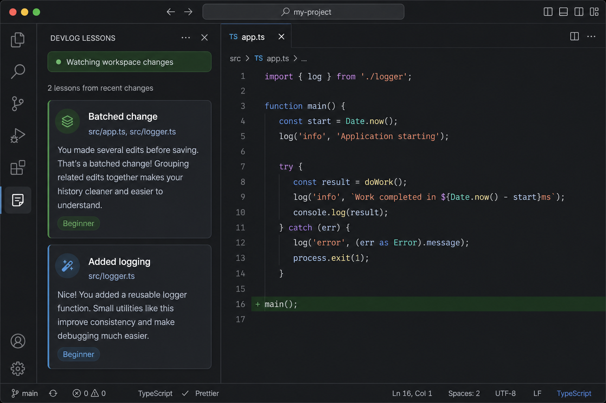

# DevLog

[](https://github.com/ARasugit20/Devlog/actions/workflows/ci.yml)

<!-- Marketplace badge: enable after publish
[](https://marketplace.visualstudio.com/items?itemName=<publisher>.devlog)
-->



DevLog is a VS Code extension that watches workspace code changes, batches related edits into one plain-English lesson, streams lessons to a sidebar panel, and can optionally sync them to Google Docs.

## Why DevLog?

DevLog is not another inline chat box. It is a persistent learning journal of what changed while you code.

- Batches related multi-file edits into one lesson instead of scattered explanations.
- Writes beginner-first summaries with concept labels.
- Keeps a sidebar history you can review after the coding session.
- Includes privacy controls and demo mode without API spend.

Unlike “just ask Cursor,” DevLog keeps a running lesson trail of what changed, when, and why it matters.

## What it does

- Watches the open workspace for file create, modify, and delete events.
- Groups changes that happen within 2 seconds into one coding-session lesson.
- Sends the batched diff to Gemini and asks for a beginner-friendly explanation plus one concept label.
- Appends each lesson to the DevLog sidebar (newest first).
- Appends the same lesson to a configured Google Doc when sync is available.

## Install in VS Code or Cursor

DevLog works in both VS Code and Cursor because both use the same extension host.

### Option A: Install from a VSIX file

1. Build a VSIX from the `devlog` folder:

```bash
npm install
npm run package
```

2. In VS Code or Cursor, open the Command Palette and run **Extensions: Install from VSIX...**.
3. Select the generated `devlog-0.1.1.vsix` file.
4. Reload the editor when prompted.
5. Open the DevLog activity bar icon on the left and choose **Lessons**.

### Option B: Run from source during development

1. Open the `devlog` folder in VS Code or Cursor.
2. Install dependencies and compile:

```bash
npm install
npm run compile
```

3. Press `F5` to launch an Extension Development Host.
4. Open a workspace folder in the Extension Development Host and make file changes to see DevLog entries appear under the DevLog activity bar.

## Gemini API key

DevLog needs each user to provide their own Google Gemini API key for translation.

1. Create an API key in [Google AI Studio](https://aistudio.google.com/apikey).
2. In VS Code or Cursor, run **DevLog: Set Gemini API Key** from the Command Palette.
3. Paste the key. DevLog stores it in VS Code Secret Storage instead of plain `settings.json`.

`devlog.geminiApiKey` still works as a fallback, but the command is the recommended setup for everyday use.

After changing configuration, run **DevLog: Start DevLog** to restart watching.

## Demo mode

Turn on `devlog.demoMode` to preview the full sidebar and batching flow without calling Gemini or using API quota.

1. Open VS Code or Cursor Settings.
2. Search for **DevLog: Demo Mode**.
3. Enable it, then run **DevLog: Start DevLog**.
4. Edit a few files and wait about 2 seconds to see one local demo lesson.

Demo mode uses simple local summaries. Turn it off and set a Gemini key when you want real AI explanations.

## Privacy

- DevLog does not include or ship an API key.
- Gemini keys entered with **DevLog: Set Gemini API Key** are stored in VS Code Secret Storage.
- File paths and diffs may be sent to Gemini so it can write lesson summaries, unless demo mode is enabled.
- Use settings such as `devlog.redactSecrets`, `devlog.includeFilePaths`, `devlog.maxFileSizeKb`, `devlog.maxDiffChars`, and `devlog.maxPromptChars` to limit data sent out.
- Google Docs sync is optional and only runs when `devlog.docsSyncEnabled` is true.
- Run **DevLog: Show DevLog Privacy Info** anytime for a data-sharing reminder.

Read the full privacy notes in [docs/PRIVACY.md](docs/PRIVACY.md).

## Google Docs sync

- `devlog.docsSyncEnabled` — enables Docs sync.
- `devlog.googleDocId` — target Google Doc ID.
- `devlog.googleOAuthCredentialsPath` — path to Google OAuth desktop credentials JSON.

Recommended setup:
1. Set `devlog.docsSyncEnabled` to true.
2. Set `devlog.googleDocId`.
3. Set `devlog.googleOAuthCredentialsPath`.
4. Run **DevLog: Connect Google Docs (OAuth)** and paste the auth code.
5. Run **DevLog: Test Google Docs Sync**.

Fallback setup (advanced): Application Default Credentials (`GOOGLE_APPLICATION_CREDENTIALS`) is still supported if OAuth credentials are not configured.

Read the full setup guide in [docs/GOOGLE_DOCS.md](docs/GOOGLE_DOCS.md).

## Controls and status

- **DevLog: Start DevLog** — restart with latest settings.
- **DevLog: Pause DevLog Watcher** / **Resume DevLog Watcher** — control active file watching.
- Sidebar includes clear, pause, resume controls and status banner.
- Lessons are persisted in workspace storage with configurable retention (`devlog.maxLessons`).

## Share DevLog with other users

- Send them the built `.vsix` file and the install steps above.
- For wider distribution, publish the extension to the Visual Studio Marketplace with `npx vsce publish` after creating a publisher account.

## Publish to the Visual Studio Marketplace

1. Create a Visual Studio Marketplace publisher.
2. Update `publisher` in `package.json` to exactly match your Marketplace publisher id.
3. Login and publish from the `devlog` folder:

```bash
npx @vscode/vsce login <publisher-id>
npx @vscode/vsce publish
```

The package includes Marketplace metadata, a license, changelog, repository links, and a packaged extension icon.

## Open VSX

Open VSX publishing is a stretch distribution path for editors that consume Open VSX.

```bash
npx ovsx publish devlog-0.1.1.vsix
```

Create an Open VSX namespace first and use the matching publisher/namespace.
